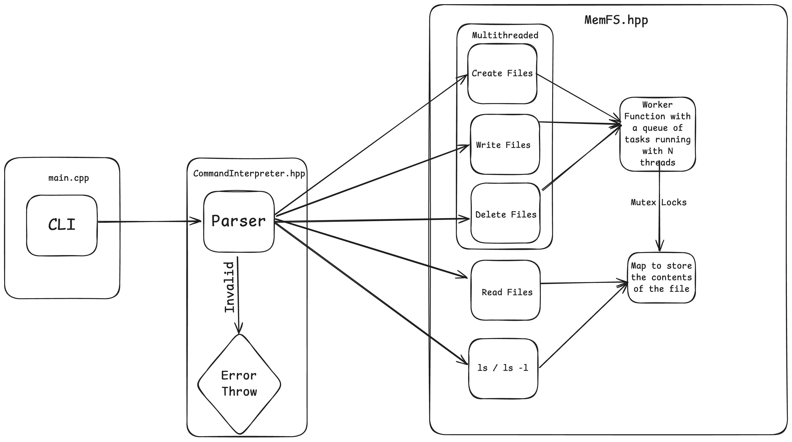

# MemFS CL-Project (24CS60R12)

## Overview

**MemFS** is an in-memory file system implemented in C++. It provides a lightweight, thread-safe solution for file storage and manipulation, entirely residing in memory. MemFS supports basic file operations such as:

- **Create**: Add new files to the memory file system.
- **Write**: Append content to existing files.
- **Read**: Retrieve the content of a file.
- **Delete**: Remove files from the file system.
- **List (ls)**: Display metadata about files, including their size and timestamps.



## Design & Report
Please refer to [Design Doc](./Design/main.pdf) & [Report](./Report/main.pdf)

### Key Features

- **Thread-Safe Operations**: Supports concurrent execution using a thread pool.
- **Asynchronous Task Queue**: Manages tasks with synchronization and batch processing.
- **File Metadata**: Tracks creation and modification timestamps for files.
- **File Size Limitation**: Enforces a maximum file size of 2048 bytes to ensure controlled memory usage.

The project is divided into two parts:
1. **Core Functionality**: Demonstration of MemFS features.
2. **Benchmarking**: Performance evaluation of MemFS.

## File Structure
```
src
├── CommandInterpreter.hpp #Header file for interpreting and executing commands in the MemFS system
├── MemFS.hpp # Header file defining the MemFS class and core file system logic
├── benchmark.cpp # Benchmarking program to evaluate MemFS performance under various workloads
└── main.cpp # Main Program to run CLI
```


## Make Commands

The following make commands are available:

- `make run`: Compiles and runs the CLI program
  - Compiles `src/main.cpp` with C++11 standard
  - Executes the resulting binary

- `make benchmark`: Compiles and runs the benchmark program (generates benchmark.txt)
  - Compiles `src/benchmark.cpp` with C++11 standard
  - Executes the resulting benchmark binary

- `make prune`: Cleans up compiled binaries
  - Removes the main executable and benchmark executable

## Commands For the CLI APP

The Command Line Interface (CLI) for MemFS provides a set of commands to interact with the in-memory file system. Below is a description of the available commands:

### File Creation
- **Create a single file**
```create <filename>```
Creates a new file with the specified filename.

- **Create multiple files**
```create -n <count> <filenames...>```
Creates multiple files. Replace `<count>` with the number of files and provide `<filenames>` separated by spaces.

### File Writing
- **Write to a single file**
```write <filename> "<content>"``
Writes the specified content to a file. Enclose the content in quotes (`"`).

- **Write to multiple files**
```write -n <count> <filename> "<content>" ...```
Writes content to multiple files. Replace `<count>` with the number of filename/content pairs, and provide them as space-separated values.

### File Reading
- **Read a file**
```read <filename>```
Displays the content of the specified file.

### File Deletion
- **Delete a single file**
```delete <filename>```
Deletes the specified file.

- **Delete multiple files**
```delete -n <count> <filenames...>```
Deletes multiple files. Replace `<count>` with the number of files and provide `<filenames>` separated by spaces.

### Directory Listing
- **List all files**
```ls```
Lists all files in the directory.

- **List files with details**
```ls -l```
Lists all files with additional details such as file size, creation time, and last modified time.

### General Commands
- **Show Help Menu**
```help```
Displays the help menu with available commands.

- **Clear the Screen**
```clear```
Clears the terminal screen.

- **Exit the Program**
```exit```
Terminates the CLI application.

### Examples

1. Create a single file:
```create myfile.txt```
2. Create multiple files:
```create -n 3 file1.txt file2.txt file3.txt```
3. Write to a file:
```write myfile.txt "Hello"```
4. Read a file:
```read myfile.txt```
5. List files with details:
```ls -l```
6. Delete multiple files:
```delete -n 2 file1.txt file2.txt```
